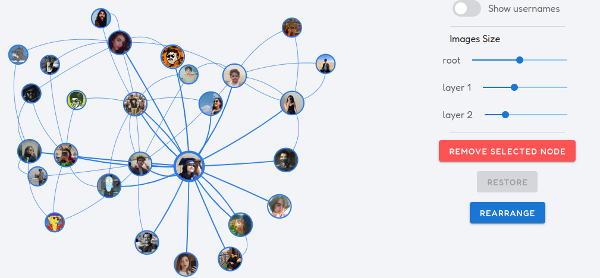

# Twitter-interactions-graph

Inspired by [Chirpty](https://github.com/duiker101/twitter-interaction-circles), I created this to see not only your best Twitter friends but also friends of your friends and the relationships between them.